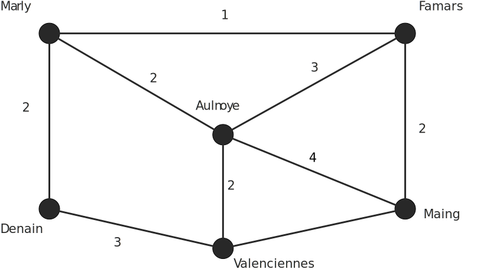
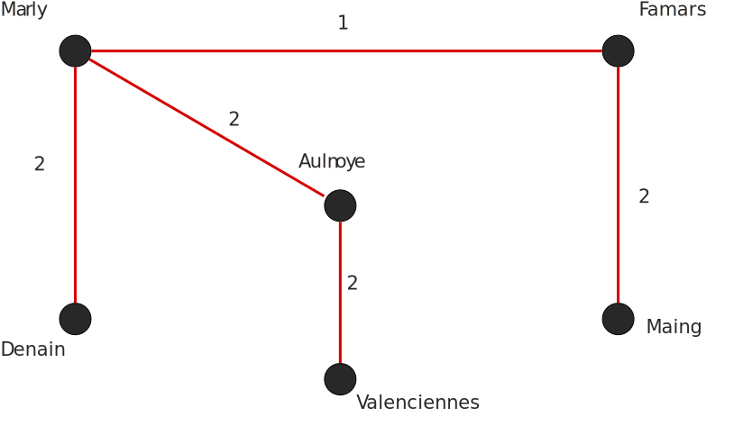

## Algorithme de Kruskal

Algorithme permettant de minimiser le câblage entre différents points (différentes villes par exemple).

* Lister toutes les arêtes
* Trier cette liste par valeurs croissantes
* Jusqu'à ce que tous les sites soient connectés, construire le graphe de coût optionel en puisant dans la liste triée (on ne retient un arc que s'il ne forme pas un cycle (boucle)).

## Exemple

Voici un tableau répertoriant les distances entre les différentes villes :

|                  | **Marly** | **F**   | **A**  | **D**  | **Va**    | **Maing** |
|------|:---------:|:---------:|:-------:|:------:|:------:|:---------:|:---------:|
| **Marly**        |           | 1       | 2      | 2      |           |           |
| **Famars**       | 1         |         | 3      |        |           | 2         |
| **Aulnoye**      | 2         | 3       |        |        | 2         | 4         |
| **Denain**       | 2         |         |        |        | 3         |           |
| **Valenciennes** |           |         | 2      | 3      |           | 3         |
| **Maing**        |           | 2       | 4      |        | 3         |           |

Représentation sous forme de graphe :

On cherche maintenant à minimiser le câblage entre les différents sites. On applique donc l'algorithme en listant les différentes arêtes dans l'ordre **croissant**. On a ainsi :

* Marly - Famars  = 1
* Marly - Aulnoye = 2
* Marly - Denain  = 2
* Famars - Maing  = 2
* Aulnoye - Valenc = 2
* Famars - Aulnoye = 3
* Denain - Valenc  = 3
* Maing - Valenc   = 3

On puise ensuite une à une les arêtes dans la liste et une fois que tous les sites
sont connectés entre eux, on arête. On obtient donc le graphe suivant (seul les 5 premières arêtes sont nécessaires) :

