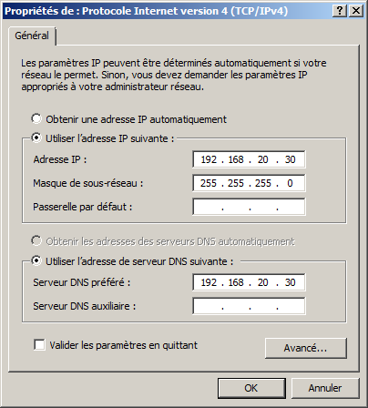

## Mettre en place le DNS sous Windows Server (2008 R2)

Il faut que les machines aient les adresses IPs suivantes:

* Linux: `192.168.20.10`
* Windows Server: `192.168.20.30`
* Windows 7: `192.160.20.45`

Pour changer l'adresse IP sous Ubuntu, faire clique droit sur l'icône réseau et choisir "Modifier les connexions" / "Edit connections", cliquer sur la deuxième connexion et faire "Modifier" / "Edit". Ensuite, aller dans l'onglet IPv4 et définir l'adresse. Le masque doit se mettre automatiquement.

Pour assigner une adresse IP sous Windows, faire clique droit sur l'icône réseau dans la barre des tâches en bas à droite et "Ouvrir le centre de réseau et partage". Ensuite, à droite cliquer sur "Connexion au réseau local", aller dans "Propriétés", cliquer sur "Protocole Internet version 4 (TCP/IPv4)" puis cliquer sur "Propriétés" et compléter de la manière suivante:

Pour activer le serveur DNS, aller dans Démarrer -> Outils d'administration > Gestionnaire de Serveur. Ensuite dans le panneau de gauche, cliquer sur le signe `+` près de "Rôles". Faire clique droit sur "Rôles" et faire "Ajouter des rôles", ensuite cocher la case "Serveur DNS" et faire "Suivant" plusieurs fois.

Pour mettre en place le serveur DNS, aller dans Démarrer -> Outils d'administration -> DNS et cliquer sur le petit `+` près du nom de l'ordinateur puis cliquer sur le signe `+` pour "Zones de recherche directe" et "Zones de recherche inversée".

Sur "Zones de recherche directe", faire clique droit et "Nouvelle zone", sélectionner "Zone principale" et lui donner le nom `martinez.com`. Ensuite sur l'entrée `martinez.com` dans le panneau de gauche, faire clique droit et "Nouvel hôte (A ou AAA)" et remplir le nom et l'adresse IP de la machine faisant partit du réseau:

Puis faire pareil pour chaque machine du réseau. Ensuite, il faut faire clique droit sur "Zone de recherche inversée" et faire "Nouvelle zone" en selectionnant "Zone principale" puis sélectionner "IPv4". L'id du réseau est `192.168.20` (Windows se chargera de l'inverser en `20.168.192` lui même).

Ensuite, il faut faire clique droit sur la zone créée et faire "Nouveau pointeur (PTR)" et remplir les informations comme lorsque l'hôte a été créé dans la zone de recherche directe (e.g. `192.168.20.10` pour l'IP et `linux` pour le nom d'hôte).

Une fois que tous les hôtes ont été ajoutés, il faut aller dans Démarrer -> Services puis descendre et chercher "Serveur DNS" ; faire clique droit et "Redémarrer".

Finalement, si les autres machines virtuelles sont bien démarrées et ont la bonne adresse IP, on peut démarrer une invite de commande Windows et taper `nslookup` puis un nom de machine ou une adresse IP et voir si l'on récupère les bonnes informations.

<pre style="background: #222; color: #ddd"><code>Microsoft Windows [Version 6.1.7061]
Copyright (c) 2009 Microsoft Corporation. Tous droits réservés.

C:\Users\Administrateur> nslookup
Serveur par défaut : win-dp8es89it8.martinez.com
Address: 192.168.20.30

> linux.martinez.com
Serveur : win-dp8es89it8.martinez.com
Address: 192.168.20.30

Nom  : linux.martinez.com
Address: 192.168.20.10

> 192.168.20.10
Serveur : win-dp8es89it8.martinez.com
Address: 192.168.20.30

Nom  : linux.martinez.com
Address: 192.168.20.10
</code></pre>
