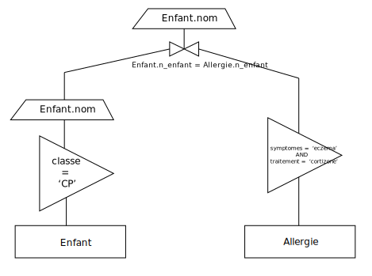
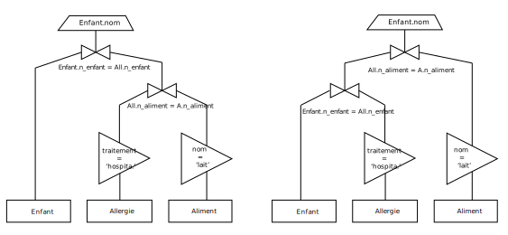
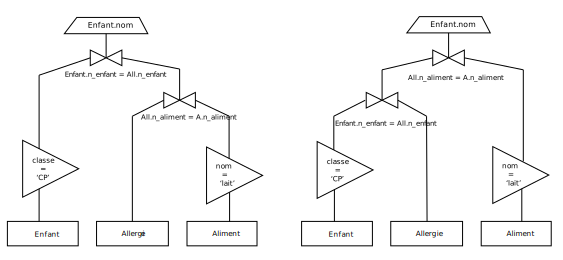
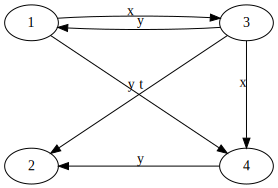

# Correction du sujet de DS - première session

Relations :

* Ecole(<u>n_ecole</u>, nom, adresse, nomDirecteur)
* Enfant(<u>n_enfant</u>, nom, prenom, date_naissance, classe, #n_ecole)
* Aliment(<u>n_aliment</u>, nom, famille, origine)
* Allergie(<u>#n_enfant</u>, <u>#n_aliment</u>, symptomes, traitement)

Chaque relation a un index sur sa clé primaire.
Il y a également un index sur l'attribut `nom` de la table `Aliment`.

## Exercice 1 - Optimisations de requêtes

#### Pour chacune des 3 requêtes

**1. Après optimisation algébrique, donnez les arbes algébriques enviseageables
pour la requête en faisant apparaître les différents blocs d'opérations nécessaires
(restriction / projection ou jointure / projection)**

Pour la requête R1 :

~~~sql
SELECT Enfant.nom
FROM Enfant, Allergie
WHERE Allergie.symptomes = 'eczema'
AND Allergie.traitement = 'cortisone'
AND Enfant.classe = 'CP'
AND Enfant.n_enfant = Allergie.n_enfant;
~~~

On a :

Pour la requête R2 :

~~~sql
SELECT Enfant.nom
FROM Enfant, Allergie, Aliment
WHERE Allergie.n_aliment = Aliment.n_aliment
AND Allergie.n_enfant = Enfant.n_enfant
AND Aliment.nom = 'lait'
AND Allergie.traitement = 'hospitalisation';
~~~

On a deux arbres possibles :

Pour la requête R3 :

~~~sql
SELECT Ecole.n_ecole
FROM Ecole, Enfant, Aliment, Allergie
WHERE Ecole.n_ecole = Enfant.n_ecole
AND Enfant.n_enfant = Allergie.n_enfant
AND Allergie.n_aliment = Aliment.n_aliment
AND Aliment.nom = 'lait'
AND Eleve.classe = 'CP';
~~~

Puisque l'on récupère uniquement le champ `n_ecole`, on peut très bien se passer
de la relation `Ecole` puisque `Enfant` a déjà un champ `n_ecole`. La requête
peut donc s'écrire :

~~~sql
SELECT Enfant.n_ecole
FROM Enfant, Aliment, Allergie
AND Enfant.n_enfant = Allergie.n_enfant
AND Allergie.n_aliment = Aliment.n_aliment
AND Aliment.nom = 'lait'
AND Eleve.classe = 'CP';
~~~

On a donc deux arbres possibles :

**2. Décrivez en détail les différents plans d'exécution possibles en supposant
que le SGBD dispose de 2 algorithmes de restriction / projection : par balaye
séquentiel ou par index et de 2 algorithmes de jointure / projection : par
boucles imbriquées et par tri fusion.**

#### Pour R1

Opérations possibles :

1. RBS
2. RBS
3. JBI / JTF

Plans d'exécution :

1. RBS + RBS + JTF
2. RBS + RBS + JBI

#### Pour R2

Opérations possibles :

1. RBS
2. RBS / RBI
3. JBI / JTF
4. JBI / JTF

Plans d'exécution :

1. RBS + RBS + JTF + JTF
2. RBS + RBS + JBI + JBI
3. RBS + RBS + JBI + JTF
4. RBS + RBS + JTF + JBI
5. RBS + RBI + JTF + JTF
6. RBS + RBI + JBI + JBI
7. RBS + RBI + JBI + JTF
8. RBS + RBI + JTF + JBI

#### Pour R3

Opréations possibles :

1. RBS
2. RBS / RBI
3. JBI / JTF
4. JBI / JTF

Plans d'exécution :

* On a les mêmes opérations possibles que pour R2 donc mêmes plans d'exécution.

**3. Application numérique pour la requête R1**

Calculez le coût des différents plans d'exécution en considérant que :

* La taille des attributs `n_ecole`, `n_enfant` et `n_aliment` est de 20ko, la
  taille de tous les autres attributs est de 40ko.
* La taille d'une page est de 1000ko.
* La relation `Enfant` possède 5000 tuples.
* La relation `Allergie` possède 15 000 tuples.
* 15% des élèves sont au CP.
* 20% des allergies ont comme symptômes l'eczéma et 5% des allergies ont comme
  traitement la cortizone.

> Avec NT le nombre de tuples, NP le nombre de pages, CPU = 0.1 et Buf = 10

Restriction par balaye séquentiel sur la relation S :

&nbsp; &nbsp; Coût(RBS) = NT(S) * CPU + NP(S)

Jointure par boucle imbriquée entre les relations S et Q :

&nbsp; &nbsp; Coût(JBI) = (NT(S) + NT(Q)) * CPU + NP(S) * (1 + NP(Q) / Buf)

Jointure par tri fusion entre les relations S et Q :

&nbsp; &nbsp; Coût(JTF) = (NT(S) + NT(Q)) * CPU + CoutTri(S) + CoutTri(Q) + NP(S) + NP(Q)

Tri d'une relation S :

&nbsp; &nbsp; CoûtTri(S) = 2 * NP(S) + logBuf(NP(S))

-------------------------------------------------------------------------------

On sait que l'on a 5000 tuples dans la table `Enfant`. De plus, d'après l'énoncé,
la taille d'un tuple de cette table est de 200ko (20 + 40 + 40 + 40 + 40 + 20).
On peut donc placer 5 tuples par page, ce qui fait que l'on a besoin de 1 000 pages
pour faire un balayage séquentiel sur cette table.

&nbsp; &nbsp; Coût(RBSEnfant) = 5000 &times; 0.1 + 1000 = 1500

On utilise le même raisonnement pour la table `Allergie` dont les tuples sont au
nombre de 15 000 et dont la taille est de 120ko. On peut donc placer 8 tuples par
page ; il faut donc 15 000 / 8 pages pour faire un balayage séquentiel sur cette
table :

&nbsp; &nbsp; Coût(RBSAllergie) = 15000 &times; 0.1 + 1875 = 3375

#### Pour le plan RBS + RBS + JBI

On sait qu'il y 15% des élèves qui sont au CP soit 15% &times; 5000 = 750. De plus,
20% des allergies produisent de l'eczéma et 5% sont traités à la cortizone. On a donc
20% &times; 5% &times; 15000 = 150 entrées.

On a donc besoin de 150 pages pour stocker les tuples de la table `Eleve` et de 19
pages pour stocker les tuples de la table `Allergie`. On a donc :

&nbsp; &nbsp; Coût(JBI) = (750 + 150) &times; 0.1 + 150 &times; (1 + 19 / 10) = 525

#### Pour le plan RBS + RBS + JTF

Par rapport aux données précédemment calculées, on a :

&nbsp; &nbsp; CoûtTri(Enfant) = 2 &times; 150 + log10(150) &asymp; 302.18

&nbsp; &nbsp; CoûtTri(Allergie) = 2 &times; 19 + log10(19) &asymp; 39.28

On a donc :

&nbsp; &nbsp; Coût(JTF) = (750 + 150) &times; 0.1 + 302.18 + 39.38 + 150 + 19 &asymp; 600.56

## Exercice 2 - Transactions

Les transactions T1, T2, T3, T4 et T5 s'exécutent de manière concurrente. Soit H un
historique d'exécution. On a :

<pre style="background: white">
H = { r1(X), w3(X), w3(Y), r1(Y), r3(T), c3, w4(Y), r2(Y), r4(X), w2(T), c1, c2, c4}
</pre>

L'exécution H a-t-elle une exécution en série équivalente ? Justifiez. Donnez une
exécution envisageable pour H, quel mécanisme utilisez-vous ?

-------------------------------------------------------------------------------

On classe tout d'abord les éléments par relation :

<pre style="background: white">
H = { r1(X), w3(X), r4(X), w3(Y), r1(Y), w4(Y), r2(Y), r3(T), c3, w2(T), c1, c2, c4}
</pre>

On a donc le graphe de dépendances suivant :

Il y a un cycle entre T1 et T3, ce qui veut dire que H n'a pas d'exécution en série équivalente ; elle n'est pas sérializable.

Pour exécuter H, on utilise un verouillage à deux phases :

<pre style="background: white">
r1(X) : Verrou lect1(X)
w3(X) : -> T3 bloquée
w3(Y) : -> T3 bloquée
r1(Y) : Verrou lect1(Y)
r3(T) : -> T3 bloquée
c3    : -> T3 bloquée
w4(Y) : -> T4 bloquée
r2(Y) : -> Verrou lect1,2(Y)
r4(X) : -> T4 bloquée
w2(T) : -> Verrou ecr2(T)
c1    : <strong>Commit de T1</strong> - On relâche les verrous
c2    : <strong>Commit de T2</strong> - On relâche les verrous
c4    : -> T4 bloquée
</pre>

On reprend ensuite toutes les opérations qui ont été bloquées :

<pre style="background: white">
w3(X) : Verrou ecr3(X)
w3(Y) : Verrou ecr3(Y)
r3(T) : Verrou lect3(T)
c3    : <strong>Commit de T3</strong> - On relâche les verrous
w4(Y) : Verrou ecr4(Y)
r4(X) : Verrou lec4(X)
c4    : <strong>Commit de T4</strong> - On relâche les verrous
</pre>

## Exercice 3 - Questions

**1. Est-ce que l'utilisation d'un index permet toujours d'optimiser l'exécution
d'une requête avec restriction dans tous les cas ? Justifiez votre réponse**

Un index ne permet pas toujours d'optimiser l'exécution d'une requête avec une
restriction. Ça n'a d'intérêt que si la table a déjà suffisamment de tuples présents,
si la restriction n'utilise pas des fonctions SQL et si ce champ est accédé
fréquemment et s'il a une bonne sélectivité.

**2. Soient les 2 tables suivantes, détaillez les étapes d'un algorithme de jointure
par tri fusion entre `contribution` et `produit` sur l'attribute `Gencod`.**

> Par soucis de simplicité il n'y a que la colonne `GenCode` et une autre colonne
> pour aider à s'y retrouver mais pas besoin du reste de la table.

*Contribution*

| NumC | ... | GenCode |
|:----:|:---:|:-------:|
| 1    | ... |  Null   |
| 2    | ... |  03341  |
| 3    | ... |  66433  |
| 4    | ... |  66433  |
| 5    | ... |  35643  |
| 6    | ... |  Null   |
| 7    | ... |  13365  |
| 8    | ... |  Null   |

*Produit*

| GenCode | Design   | ... |
|:-------:|:--------:|:---:|
|  03341  | Ballon   | ... |
|  66433  | Cuillère | ... |
|  35643  | Vase     | ... |
|  13365  | Assiette | ... |

-------------------------------------------------------------------------------

Le SGBD va tout d'abord trier les deux relations via l'algorithme de tri fusion
classique, c'est à dire en divisant la relation en deux relations plus petites
et en les triant chacune *via* la même technique.

On a donc les deux relations triées sur l'attribut `GenCode`

*Contribution*

| NumC | ... | GenCode |
|:----:|:---:|:-------:|
| 1    | ... |  Null   |
| 6    | ... |  Null   |
| 8    | ... |  Null   |
| 2    | ... |  03341  |
| 7    | ... |  13365  |
| 5    | ... |  35643  |
| 3    | ... |  66433  |
| 4    | ... |  66433  |

*Produit*

| GenCode | Design   | ... |
|:-------:|:--------:|:---:|
|  03341  | Ballon   | ... |
|  13365  | Assiette | ... |
|  35643  | Vase     | ... |
|  66433  | Cuillère | ... |

Le SGBD va ensuite lire les tuples des deux relations en parralèle et va associer
les entrées qui ont le même `GenCode` ensemble. Le résultat sera donc une relation
trié sur l'attribut `GenCode`.
