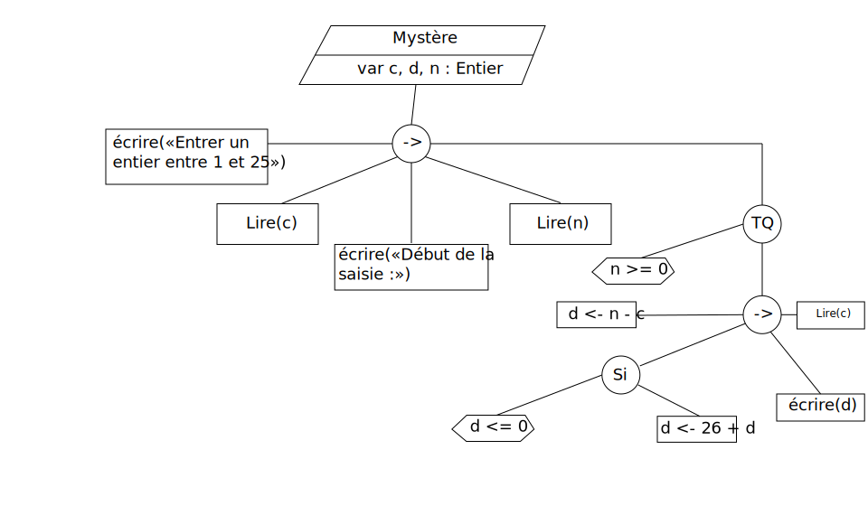

## Correction DS 2014-2015

### Exercice 1

**1. A quoi sert l'instruction `lire` dans un algorithme ?**

L'instruction `lire` sert à demander une valeur à l'utilisateur lors de l'exécution.

**2. Citez trois types de données parmi ceux déjà utilisés ce semestre ?**

* Entier
* Booléen
* Chaîne
* Caractère

**3. Peut-on toujours transformer une boucle `jusqu'à` en boucle `pour` équivalente ? (justifier)**

Non, une boucle `jusqu'à` ne peut pas toujours être transformée en boucle `pour` équivalente car la boucle `pour` permet uniquement d'itérer entre deux nombres alors que le jusqu'à prend en paramètre une condition quelconque, le nombre d'itérations n'est pas forcément connu à l'avance.

**4. Donner le type et la valeur des expressions suivantes**

* **faux ou (vrai ou faux)**
* **(3 * 5) DIV 2**
* **(-1 < 3) et (2 > 3)**
* **3.0 - 4.5**

<ul>
  <li>1.
    <ul>
      <li>Type : booléen</li>
      <li>Valeur : vrai</li>
    </ul>
  </li>
  <li>2.
    <ul>
      <li>Type : entier</li>
      <li>Valeur : 7</li>
    </ul>
  </li>
  <li>3.
    <ul>
      <li>Type : booléen</li>
      <li>Valeur : faux</li>
    </ul>
  </li>
  <li>4.
    <ul>
      <li>Type : réel</li>
      <li>Valeur : -1,5</li>
    </ul>
  </li>
</ul>

## Exercice 2

~~~pseudo
programme mystère
  var c, d, n : entier
début
  écrire("Entrer un entier entre 1 et 25 : ");
  lire(c);

  écrire("Début de la saisie :")
  lire(n);

  tant que (n >= 0) faire
  début
    d <- n - c;

    si (d < 0) alors
      d <- 26 + d;
    fin

    écrire(d);
    lire(n);
  fin
fin
~~~

**1. Construire l'arbre programmatique du programme `mystère`.**

**2. Transformer l'algorithme `mystère` en remplaçant la boucle `tant que` par une boucle `pour`.**

Il n'est pas possible de transformer cet algorithme via une boucle `pour` car les valeurs de n sont entrées au clavier, on ne peut donc pas déterminer le nombre d'itérations qui seront faites (c.f exercice 1, question 3).

**3. Transformer l'algorithme `mystère` en remplaçant la boucle `tant que` par une `jusqu'à`.**

~~~pseudo
programme mystère
  var c, d, n : entier
début
  écrire("Entrer un entier entre 1 et 25 : ");
  lire(c);

  écrire("Début de la saisie : ");
  lire(n)

  répéter
    d <- n - c;

    si (d < 0) alors
      d <- 26 + d;
    fin

    écrire(d);
    lire(n);

  jusqu'à ce que (n < 0)
fin
~~~

**4. Dérouler l'algorithme avec `c = 13` et le séquence de valeurs suivantes : 18 21 0 17 10 1 -1. Notez bien les valeurs successives de la variable d.**

Avec n = 18, d = 5
Avec n = 21, d = 8
Avec n = 0,  d = -13 puis d = -13
Avec n = 17, d = 4
Avec n = 10, d = -3 puis d = 23
Avec n = 1,  d = -12 puis d = 14
Avec n = -1 : on stoppe la boucle

**5. En associant chaque valeur de la variable `d` de la question 4 à la lettre de l'alphabet qui correspond (on utilisera la convention A <-> 0, B <-> 1, ..., Z <-> 25), quel est le message qui se cache derrière cette suite de valeurs ?**

D'après l'énoncé de la question, la réponse est :

~~~
F I N E X O
~~~

**6. La valeur de la variable c est importante pour obtenir le bon résultat. Que proposez vous d'ajouter avant la boucle pour s'assurer du bon fonctionnement de l'algorithme ? Écrire un algorithme intégrant cette modification.**

Pour s'assurer du bon fonctionnement de l'algorithme on pourrait intégrer une boucle `jusqu'à` qui s'assurerait que `c` est compris entre 1 et 25.

~~~pseudo?4,7
programme mystère
  var c, d, n : entier
début
  répeter
    écrire("Entrer un entier entre 1 et 25 : ");
    lire(c);
  jusqu'à ce que (n >= 1 et n <= 25)

  écrire("Début de la saisie : ");
  lire(n)

  faire
    d <- n - c;

    si (d < 0) alors
      d <- 26 + d;
    fin

    écrire(d);
    lire(n);

  jusqu'à ce que (n < 0)
fin
~~~

## Exercice 3

**1. Écrire un algorithme qui détermine et affiche le minimum entre deux entiers, les valeurs de ces derniers, les valeurs de ces derniers étant lues au clavier.**

~~~pseudo
programme plusPetit
 var a, b : entier
début
  écrire("Entrer a : ");
  lire(a);

  écrire("Entrer b : ");
  lire(b);

  si (a > b) alors
    écrire(b);
  sinon
    écrire(a);
  fin
fin
~~~

**2. Même question qu'en 1 mais sans utiliser de `sinon` et avec un seul si.**

~~~pseudo?2,10,12,13,16
programme plusPetit2
 var a, b, m : entier
début
  écrire("Entrer a : ");
  lire(a);

  écrire("Entrer b : ");
  lire(b);

  m <- b

  si (a < b) alors
    m <- a;
  fin

  écrire(m);
fin
~~~

**3. Écrire un algorithme qui détermine et affiche le minimum dans une suite de n valeurs lues au clavier, une à une (n est également lu au clavier au début de l'algorithme).**

~~~pseudo
programme plusPetitSuite
  var n, i, a, m : Entier
début
  écrire("Nombre de valeurs à entrer : ");
  lire(n);

  pour i de 1 à n faire
    lire(a);

    si (i = 1 ou a < m) alors
      m <- a
    fin si
  fin

  ecrire(m);
fin
~~~

**4. Transformer l'algorithme de la question 3 en changeant la boucle utilisée.**

~~~pseudo?7,9,16,17
programme plusPetitSuite2
  var n, i, a, m : Entier
début
  écrire("Nombre de valeurs à entrer : ");
  lire(n);

  i = 1

  tant que (i <= n) faire
    lire(a);

    si (i = 1 ou a < m) alors
      m <- a
    fin si

    // Super important pour éviter une boucle infinie
    i <- i + 1
  fin

  ecrire(m);
fin
~~~
