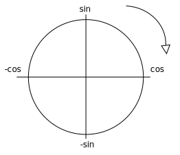

# Le développement limité

Le développement limité consiste à transformer une fonction en un polynôme qui est
une somme d'éléments. Ces éléments sont trouvés à partir de la formule de
Taylor-Young.

Le but du développement limité est de trouver un polynôme qui se rapproche le plus
possible d'une fonction. Pour certaines fonctions, il est difficile de :

* Les dériver
* Trouver les limites
* Prouver qu'elles sont intégrables

Si on arrive à trouver le développement limité d'une fonction, on peut ensuite
dériver, trouver les limites, etc.

## Formule de Taylor-Young

C'est cette formule qui permet de trouver le développement limité d'une fonction :

Si on a une fonction f dérivable n fois au point x0, le
développement limité en ce point est :

Où :

* `k!` est la factorielle de k (e.g. 3! = 1 &times; 2 &times; 3).
* <code>f(k)</code> est la k-ième dérivée de la fonction f.

Plus on calcul d'éléments de cette formule, et plus on s'approche de la fonction
initiale.

### Exemple

Prenons par exemple, la fonction :

#### Première itération

On applique la formule de Taylor-Young une première fois. Ici, on va prendre x0 = 0.

On a donc :

> **Petite aide** : Pour dériver les fonctions `sin` et `cos` plusieurs fois
> facilement, on peut se représenter le cercle trigonométrique, placer les fonctions
> sur les extrémités des axes et tourner dans le sens des aiguilles d'une montre pour
> avoir la fonction dérivée.
>
> Par exemple, la dérivée de `sin(x)` est `cos(x)`, la dérivée de `cos(x)` est `-sin(x)`, etc.
>
> 

#### Deuxième itération

C'est vraiment pas terrible, du coup on calcule la deuxième itération :

Puisque la fonction est paire, on tombe sur un zéro et on retrouve la même formule que précédemment, on applique donc une nouvelle itération :

### Troisième itération

C'est déjà mieux mais on peut essayer de refaire une itération (ou deux puisque le
prochain membre de la formule de Taylor-Young produira un zéro ici) pour se
rapprocher encore un peu plus :

